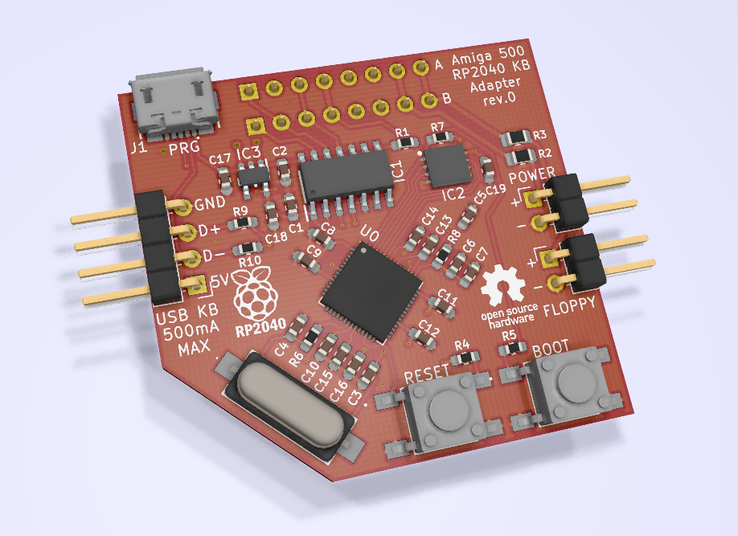

# A500 USB Keyboard Adapter JLC
A USB keyboard adapter for the Amiga 500 based on a simplified RP2040 design for JLCPCB Assembly

## Intro
This is a USB keyboard adapter I designed a board for to use in my Amiga 500 tower or bench testing. It is based on the amigahid-pico firmware by borb (nine). The KiCAD files, Gerbers, and BOM are in this repository, as well as the JLCPCB BOM and Pick'n'Place CPL files. The completed board attaches to the A500's keyboard header and provides a USB pin header for your interface device. On my build, I used a pin header to female USB Type A cable that screws into in the rear of my case on a PCI bracket.

Demo Video: https://youtu.be/7yw0AOvhLqg  (original board shown, this repository is an updated/simplified design for JLCPCB assembly)

## Parts
* In the Master BOM file, order the parts needed for hand soldering only. JLCPBC will do all the tough surface mount work. With 5 assembled boards, it comes out to roughly $15 each with shipping. (cheapest options / slow boat shipping)

## Building the Adapter
* Use JLCPCB's assembly service -- Upload the gerber files, choose your board color, and specify the Remove Order Number field as "Provided by Customer".
* Select the PCB Assembly slider and ensure you want either 2 or 5 boards assembled (top side only) and click confirm. Leave all other settings as-is.
* Click next at the board preview.
* On the Bill of Materials page, upload the BOM from the JLCPCB folder in this repo, as well as the Pick-n-Place CPL file. Click "Process BOM & CPL".
* Check to make sure all parts are available and click next, otherwise you have to substitute parts if a compatible part is in stock. (fit/form/function) Click next.
* On the Component Placement screen, ensure all parts are oriented and placed properly. Pay attention to Pin 1 on the chips. Click next.
* Choose the product type -- I recommend selecting "DIY". Save to cart and process your order.
* Solder the hand soldered components onto the board in their appropriate locations.

## Flashing the Firmware
First off, a huge thank you to Nine for developing the amigahid-pico, as this design uses its firmware. Firmware is located at: https://github.com/borb/amigahid-pico/
1. Build the firmware per the instructions at https://github.com/borb/amigahid-pico/blob/main/doc/installation.md
2. Hold the BOOT button.
3. Plug a MicroUSB cable to the PCB's MicroUSB port and plug the other end into the PC you just compiled the firmware on. It will then show up as a mass storage device.
4. Release the BOOT button.
5. Copy the amigahid-pico.uf2 file from the "build/src/" directory you compiled to the RP2040's mounted USB storage volume. It will then disconnect/reset.
6. Disconnect the USB cable from the PC and keyboard adapter PCB.

## Installation into the Amiga
1. Gain access to your Amiga 500 motherboard.
2. Disconnect the keyboard if it is still connected.
3. Plug the PCB into the A500's keyboard header either the Type A or Type B socket. For reference my Amiga 500 Rev 6A needed Type A.
4. Plug your USB cable into the pin header. Pay close attention to the orientation of the leads.
5. Plug the keyboard or wireless keyboard adapter into the other end of the USB cable. Don't use a blinding LED backlit keyboard that uses >500mA, as you don't want to smoke your traces.
6. Boot the Amiga and test it out!

## Optional Stuff
* If using a tower case, you can plug in the Power LED and HDD LED to the pin headers on the PCB to show the status indications.
* USB HID mouse support is included in Nine's firmware, but none of the mice I used would work with it. I use a DB9 connected OpenLaserMouse anyway, but maybe you'll have better luck testing various mice to see if one works. I know the firmware is still an in-progress project, or maybe I didn't do something right when I compiled the firmware. 
* Amiga keys are currently mapped to right and left windows keys. Before compiling the firmware, you can modify those keys if necessary at your own discretion.
* Reset is initiated by Left Ctrl + Left Win + Right Win (CTRL + AMIGA + AMIGA)
